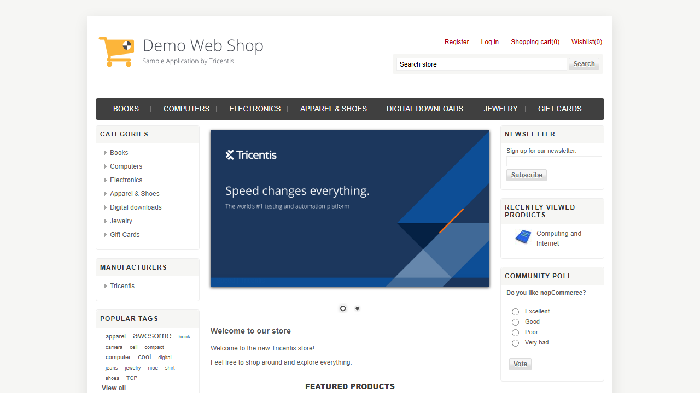

# Tricentis Demo Web Shop - Playwright Test Automation Framework

A professional, enterprise-grade test automation framework built with **Playwright**, **TypeScript**, and the **Page Object Model (POM)** pattern. This suite provides comprehensive end-to-end (E2E) and component-level test coverage for the [Tricentis Demo Web Shop](https://demowebshop.tricentis.com/) e-commerce platform.

---

## 🏛️ Architecture & Design Patterns

The framework is structured following test automation best practices, separating concerns across clean layers:

```text
├── .agents/                # Custom workspace agent configurations
├── media/                  # Test execution media (screenshots and videos)
├── src/
│   ├── auth/               # Global Authentication setup and session storage state
│   │   ├── auth.setup.ts   # Logs in once and saves storageState to auth.json
│   │   └── Login.setup.ts  # Placeholders/configurations for login setups
│   ├── data/               # Centralized test data management
│   │   └── TestData.ts     # Structures test data and generates dynamic profiles using Faker
│   ├── page/               # Page Object Model (POM) classes defining page actions
│   │   ├── HomePage.ts     # Main landing page interactions
│   │   ├── RegisterPage.ts # Registration flow actions
│   │   ├── LoginPage.ts    # Authentication and input filling
│   │   ├── ProductPage.ts  # Category browsing, product detail, and cart additions
│   │   ├── CartPage.ts     # Quantity checks, shipping estimations, and checkout triggers
│   │   ├── CheckoutPage.ts # Checkout forms, payment method selections, and order completion
│   │   └── LogoutPage.ts   # Logout action and post-session validations
│   ├── selector/           # Separated UI locator mapping
│   │   └── Locators.ts     # Clean mapping of CSS selectors and XPath queries
│   └── tests/              # Component-level and End-to-End test suites
│       ├── Register.spec.ts# Validates user registration paths
│       ├── Login.spec.ts   # Validates authentication and validation messages
│       ├── Product.spec.ts # Verifies adding single, multiple, and multi-category items
│       ├── Cart.spec.ts    # Verifies cart counts, totals, and shipping estimation
│       ├── Checkout.spec.ts# Tests order processing using cached session states
│       └── EndtoEnd.spec.ts# Comprehensive flow (Login ➔ Shop ➔ Checkout ➔ Logout)
├── playwright.config.ts    # Centralized Playwright configuration
└── package.json            # Node.js dependencies and scripts
```

### 🔑 Session State Management (Speed & Efficiency)
To optimize execution speed, the project implements Playwright's **Global Setup**. 
- `src/auth/auth.setup.ts` logs in with valid credentials at the start of execution.
- The session cookies and storage states are saved locally into `src/auth/auth.json`.
- Subsequent test suites (configured under the `chromium-auth` project in `playwright.config.ts`) reuse this `auth.json` state, bypassing login steps to reduce execution time.
- Unauthenticated flows (such as registration and explicit login/logout tests) run under the `chromium-unauth` project without utilizing cached storage state.

---

## 📋 Test Suites Breakdown

1. **User Registration (`Register.spec.ts`)**:
   - Generates unique customer profiles dynamically using `@faker-js/faker`.
   - Validates that new users can register and transitions them into an active session.

2. **Login Verification (`Login.spec.ts`)**:
   - Tests successful authentication with valid credentials.
   - Tests failure boundaries, validating UI error messages for incorrect email, incorrect password, and empty field submissions.

3. **Product Selection & Shop (`Product.spec.ts`)**:
   - Validates navigating top-level navigation categories and nested subcategories.
   - Verifies adding single items or multiple items from listings.
   - Tests cross-category shopping baskets (e.g. mixing Books, Electronics, and Jewelry).

4. **Shopping Cart (`Cart.spec.ts`)**:
   - Verifies that items added match cart list quantities.
   - Computes tax, shipping charges, and subtotal estimations using country/zip inputs.

5. **Checkout Flow (`Checkout.spec.ts`)**:
   - Automates multi-step Billing/Shipping selections, Shipping Methods (e.g. Next Day Air), Payment Methods (e.g. Credit Card), and Order Confirmation.

6. **End-to-End Suite (`EndtoEnd.spec.ts`)**:
   - Combines all components into one continuous integration flow:
     `Start Session ➔ Login ➔ Clear Cart ➔ Shop Product ➔ Proceed Checkout ➔ Verify Order Confirmation ➔ Logout ➔ Verify Cleanup`.

---

## ⚙️ Setup & Configuration

### Prerequisites
- Node.js (v18+)
- npm (v9+)

### Installation
1. Install project dependencies:
   ```bash
   npm install
   ```

2. Download and configure required Playwright browser binaries:
   ```bash
   npx playwright install
   ```

---

## 🏃 Running Tests

You can run individual test files or execute projects using the command line:

### Run All Tests
```bash
npx.cmd playwright test
```

### Run Authenticated Tests (Reusing session state)
```bash
npx.cmd playwright test --project=chromium-auth
```

### Run Unauthenticated Tests (Independent session states)
```bash
npx.cmd playwright test --project=chromium-unauth
```

### Run Specific Test Files
- **Run the E2E Test Suite:**
  ```bash
  npx.cmd playwright test src/tests/EndtoEnd.spec.ts --project=chromium-unauth
  ```
- **Run Login Scenarios:**
  ```bash
  npx.cmd playwright test src/tests/Login.spec.ts
  ```

---

## 🎥 Execution Media & Reports

### Test Reports
The framework is configured to produce multiple reporting outputs:
- **HTML Report**: View detailed steps with execution timelines.
  ```bash
  npx.cmd playwright show-report html-report
  ```
- **Allure Reports**: Saved in `allure-results/` for dashboard integrations.

### Test Execution Media
Below are the media assets captured during test suite runs:

#### 📺 E2E Test Flow Run Video
Watch the full automated E2E test execution from login to logout:

<video src="media/endtoend-run.webm" width="100%" controls autoplay loop muted>
  Your browser does not support the video tag.
</video>

#### 📸 Successful Checkout Completion Screenshot
The success screen captured upon checking out and placing an order:


